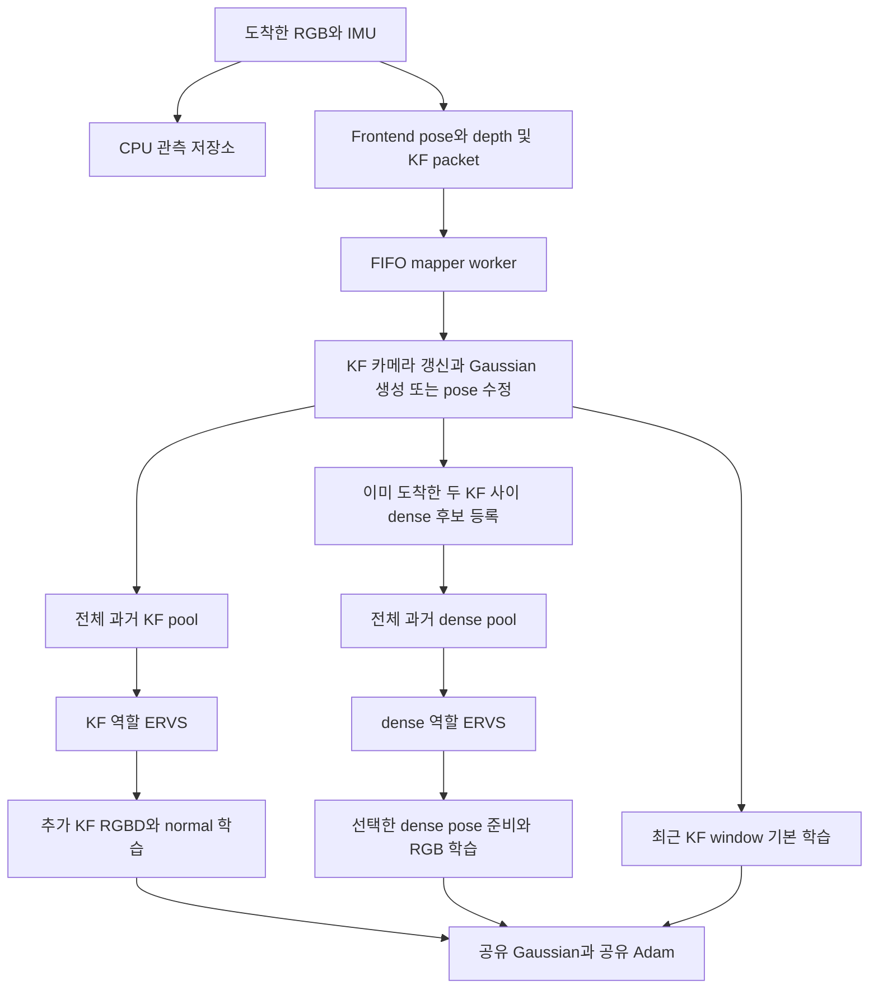

# 40 renders/KF에서 이득을 보인 paired mapper의 실제 구현

2026-09-25 코드·설정·실행 ledger 기준. 이 문서는 논문에서 의도한 설계가 아니라, Aria/RPNG/UTMM에서 동일 렌더링 수 비교를 통과한 구현을 설명한다. 생산 코드나 논문은 이 조사에서 변경하지 않았다.

> **이후 변경 — 2026-09-25:** 사용자가 누적 count 사용을 지시하여 integration 트리의 paired 기본값을 `all_rgb`로 복원했다. KF의 native+추가 사용 횟수와 dense 사용 횟수를 map generation별 누적하며 최근 history로 만료하지 않는다. 아래 본문과 40회 수치는 변경 전 recent-count 구현의 기록이다. 변경 후 동일40회 검증에서 누적 방식의 held-out PSNR은 Aria/RPNG/UTMM 24.605/24.666/21.329 dB로 vanilla 대비 +3.853/+2.205/+2.505 dB를 유지했고, 현재 코드의 recent 대조군 대비 −0.255/−0.161/−0.077 dB였다(seed0, 실제 동시 tracking 없음). [변경 계약](../cumulative_ervs/README.md) · [품질 검증 결과](../cumulative_ervs/SUMMARY.md)

> **후속 ablation — 2026-09-25:** 누적 ERVS를 유지하고 densify/prune 및 topology gate를 끈 별도 실험에서 세 장면 모두 +0.117~+0.417 dB 개선됐다. 아래 본문은 기존 topology ON 구조의 기록이며 OFF를 기본값으로 채택했다는 뜻은 아니다. [연산 제거 검증](../no_densify_prune/SUMMARY.md)

## 1. 어느 버전을 설명하는가

| 대상 | 경로/식별 | 역할 |
|---|---|---|
| 이득이 나온 custom backend | `/home/intern/VIGS-SLAM-online-worker-integration` | 이번 paired 실험의 실제 mapper |
| 고정 연산량 실행기 | `benchmarks/online_gs/campaigns/gain_attribution/run_kf15_render_worker.py` | 이름은 15지만 `--renders-per-kf 40`으로 실행 |
| 비교 실험 coordinator | `benchmarks/online_gs/campaigns/gain_attribution/run_budget40_feasibility.py` | 3개 장면 × fixed/live × vanilla/paired |
| 결과 | `results/campaigns/gain_attribution/render_budget40_feasibility/v1` | source 복사본·해시·학습 ledger·평가·지도 |
| vanilla | `/home/intern/VIGS-SLAM-official-exp78` | 공식 commit `22ffe24c6df81d0bf63bd20057565c00c51d2996`, 공통 예산 및 수치 안정성 adapter 적용 |
| 별도 생산 트리 | `/home/intern/VIGS-SLAM-paper-full` | 이번 진단에서 수정하지 않음 |

따라서 “현재 코드”라는 표현만으로 생산 트리, 과거 실험, 이 paired 분기를 같은 것으로 취급하면 안 된다. 재현 시 각 run의 `source_lock.json`과 복사된 `source/`가 기준이다.

동일40회에서 held-out PSNR은 vanilla→paired 순으로 Aria 20.75→24.86, RPNG 22.46→24.83, UTMM 18.82→21.42 dB다. 이 결과는 **동일한 causal tracker 기록을 재생한 fixed-work 비교**다. 동시 트래킹 실시간 성공이나 ERVS 단독 이득을 입증하지 않는다. [전체 결과](SUMMARY.md)

## 2. 전체 흐름



공유 지도는 하나다. 기본 window 매핑과 추가 KF/dense 학습이 **같은 Gaussian 파라미터와 Adam moments**를 순서대로 갱신한다. 추가 학습 전용 별도 지도나 별도 optimizer는 없다. KF 한 번, dense 한 번은 현재 각각 독립 optimizer step이며, 아직 하나의 묶음 step이 아니다.

## 3. 입력 도착과 worker 소유권

[`OnlineMapperRuntime`](/home/intern/VIGS-SLAM-online-worker-integration/vigs/online_mapper_runtime.py:12)이 CPU 저장소·실행 guard·학습기·FIFO worker를 연결한다.

1. `observe_rgb(uid, timestamp, image)`는 해당 RGB 시각까지의 IMU prefix만 저장소에 추가한다.
2. [`ArrivedSensorStore`](/home/intern/VIGS-SLAM-online-worker-integration/vigs/arrived_sensor_store.py:12)는 도착한 RGB를 CPU 복사본으로 보관한다. held-out 영상은 timestamp만 보관하며 학습용 픽셀은 보관하지 않는다.
3. KF packet은 pose, depth, normal, 영상 등을 mapper에 전달한다. runtime은 영상이 실제로 도착했는지와 held-out 제외 여부를 검사한다.
4. mapper worker가 자기 CUDA stream과 Gaussian lock을 잡고 packet을 처리한다. 생산자 CUDA event를 기다려 입력 준비 순서를 지킨다.
5. metric rescale과 mapper reset도 같은 FIFO에 넣는다. 별도 스레드에서 지도만 먼저 바꿔 packet과 좌표계 순서가 어긋나는 것을 막는다.

[`OnlineMappingWorker`](/home/intern/VIGS-SLAM-online-worker-integration/vigs/online_mapping_worker.py:13)는 queue가 비면 추가 학습을 시도한다. 할 수 없으면 최대 2 ms 간격으로 packet을 기다린다. 성공적으로 추가 학습한 직후에는 강제 sleep 없이 queue부터 다시 확인한다.

모든 mutation은 [`MapperExecutionGuard`](/home/intern/VIGS-SLAM-online-worker-integration/vigs/mapper_execution_guard.py:23)의 소유 스레드·deadline·EOS 검사를 받는다. 종료 후 queue를 비우는 것은 **남은 학습 실행**이 아니라 **작업 취소와 bookkeeping**이다. 이미 시작한 CUDA 작업이 deadline을 넘으면 overrun으로 기록하므로 hard real-time 보장으로 해석하면 안 된다.

## 4. 기본 KF 매핑

[`process_track_data`](/home/intern/VIGS-SLAM-online-worker-integration/vigs/gs_backend.py:6028)는 KF 카메라를 만들거나 갱신하고, 새 KF의 깊이에서 Gaussian을 생성하며, PGBA가 있으면 기존 지도와 카메라 좌표를 갱신한다.

paired 설정은 runtime에서 `n_global_views=0`, `online_native_local_only=True`를 강제한다. 저장된 config의 `n_global_views=6`은 이 실행에서는 유효 값이 아니다.

[`map`](/home/intern/VIGS-SLAM-online-worker-integration/vigs/gs_backend.py:7253)은 이 설정에서 호출자가 무엇을 넘겨도 실제 `self.current_window`를 사용하고 global view를 붙이지 않는다. PGBA packet의 여러 과거 KF pose 갱신은 수행하되, 그 뒤 기본 학습 대상은 다시 이 window다.

`window_size=10`이지만 삽입 조건은 `len(window) > window_size`이므로 충분히 채워진 실제 window는 **최대 11장**이다. 단순히 “10장 고정”이라고 쓰면 구현과 다르다. 또한 이 리스트는 mapper의 packet 처리로 갱신되는 window이며, 전체 과거 pool과 별도다.

고정40회 실행에서는 [`KeyframeRenderBudget`](/home/intern/gs_floaterLab/benchmarks/online_gs/campaigns/gain_attribution/keyframe_render_budget.py:10)이 한 RGB arrival 안에서 기본 `map` 호출을 최대 한 번 허용하고 `iters=1`로 제한한다. 남은 렌더링 credit이 부족하면 `max_viewpoints`도 줄인다. 따라서 config의 초기화 600 iter, 일반 경로의 7 iter, PGBA의 20 iter 요청을 그대로 수행하는 실험이 아니다.

기본 step은 window의 여러 영상을 렌더링하고 loss를 합산해 한 번 backward/Adam한다. kernel batch renderer 설정도 켜져 있다. 이것은 현재 추가 학습의 단일 `render()` 경로와 다르다.

## 5. Gaussian 생성·분할·제거

현재 custom은 vanilla와 동일한 Gaussian 생성 정책이 아니다.

- [`configure_density_policy`](/home/intern/gs_floaterLab/benchmarks/online_gs/exp78b_replay_gsslam_mapping.py:640)가 PPM sampling과 causal online-rank density를 설정한다. 공통 base downsample은 일반 KF 256, 초기 KF 64다.
- [`CausalOnlineRankDensity`](/home/intern/gs_floaterLab/benchmarks/online_gs/exp78b_replay_gsslam_mapping.py:144)는 현재까지 관측한 Sobel 값의 순위로 생성 배수를 정한다. mean=2.5, span=2.0이며 multiplier는 기본 상한 3.0으로 clip된다. 같은 UID는 처음 배수를 재사용한다. 미래 시퀀스 전체나 장면 이름으로 배수를 정하지 않는다.
- 기본 native 경로는 densification 통계를 쌓고 정해진 cadence에서 densify/prune를 수행한다. config는 `gaussian_update_every=150`, offset=50이다. 이는 **렌더링 수가 아니라 native iteration clock**에 연결된다.
- `mapping_observation_topology_gate=True`이며 [`TopologyReplayController`](/home/intern/VIGS-SLAM-online-worker-integration/vigs/map_scheduler.py:3867)가 반복 topology 관측과 상대 capacity 회복으로 topology 허용 여부를 정한다. 절대 frame cutoff는 -1, auto freeze는 꺼져 있다.
- 이 run은 `mapping_model_scheduler=False`다. controller의 다른 foreground/replay 배분 기능까지 모두 사용한다고 설명하면 안 된다.
- **추가 KF/dense 학습은 `OnlinePhotometricTrainer.step()`으로 바로 들어가므로 densify/prune 통계 수집이나 native iteration 증가를 수행하지 않는다.** 파라미터는 바꾸지만 Gaussian 개수를 직접 늘리는 경로는 아니다.

Carve/depth carve·detached opacity·hard floater pruning은 이번 이득 비교에서 꺼져 있다. 따라서 이번 PSNR 이득을 Carve의 효과로 연결할 수 없다.

## 6. dense pool과 메모리

`_offer_arrived_intervals()`는 현재 지도에 존재하는 인접한 두 학습 KF 사이의 도착 RGB를 후보로 등록한다. 오른쪽 KF가 아직 도착하지 않은 최신 구간의 RGB는 바로 학습 후보가 되지 않는다. 오른쪽 anchor가 확보된 시점에서 과거 중간 프레임을 사용하므로 causal 조건을 지킨다.

[`DeferredDenseObservations`](/home/intern/VIGS-SLAM-online-worker-integration/vigs/deferred_dense_observations.py:13)는 먼저 UID와 anchor metadata만 등록한다. 실제로 선택된 영상에 대해서 `prepare()`가 Camera와 pose 준비를 수행한다.

현재 `membership='immediate'`이므로 사용할 수 있는 후보는 모두 pool에 들어간다. `kappa=64`가 객체에 저장돼 있어도 **64 step마다 한 장 허용하는 Growth는 작동하지 않는다.** paired 클래스 자체가 `growth` 모드를 거부한다.

| 보관 대상 | 위치·수명 |
|---|---|
| 도착한 학습 RGB/IMU 이력 | CPU 저장소, 해당 실행 이력 누적 |
| KF 카메라와 RGB/depth/normal | mapper viewpoints, KF 데이터는 GPU resident target 사용 가능 |
| dense 후보 | UID와 interval metadata, lazy 준비 |
| 준비된 dense Camera | `polish_viewpoints`, 현재 map generation의 이력 |
| dense RGB 학습 cache | `OnlinePhotometricTrainer.images`, 기본 최근 16개 GPU target |
| dense pose 계산용 feature/대응점 | 별도 refiner의 CPU cache, 필요 시 GPU 전송 |

“dense는 GPU를 전혀 사용하지 않는다”는 설명은 틀리다. 전체 영상 이력을 GPU에 상주시켜 두지 않는 것이며, 선택된 영상과 pose 계산 입력은 GPU로 올라간다. 16개 제한은 전체 map VRAM이나 CPU history 크기의 제한도 아니다.

## 7. dense pose 준비

추가 dense 학습을 위해 정답·MPS·평가용 trajectory를 쓰지 않는다. 현재 mapper의 두 KF anchor와 도착한 RGB/IMU를 사용한다.

1. `prepare()`가 현재 KF 집합에서 해당 dense UID를 끼우는 좌우 KF를 찾는다.
2. 현재 anchor 기반 보간에 [`LiveDenseImuShaper`](/home/intern/VIGS-SLAM-online-worker-integration/vigs/live_dense_imu.py:8)의 gyro 회전 residual을 적용한다. IMU는 오른쪽 anchor 시각까지만 사용한다.
3. [`live_dense_pose_refresh`](/home/intern/VIGS-SLAM-online-worker-integration/vigs/live_dense_pose_refresh.py:40)는 anchor 변경 시 보간을 다시 계산하고 residual을 한 번 적용한다. 기존 보정에 같은 residual을 반복해서 곱하지 않도록 한다.
4. [`dense_pose_lazy_refresh`](/home/intern/VIGS-SLAM-online-worker-integration/vigs/dense_pose_lazy_refresh.py:10)는 PGBA 때 모든 dense 카메라를 즉시 계산하는 대신 invalidation 표시를 하고, 선택된 카메라만 최신화한다.
5. [`dense_visual_pose`](/home/intern/VIGS-SLAM-online-worker-integration/vigs/dense_visual_pose.py:129)는 두 anchor의 영상 대응점을 이용한 motion-only refinement를 수행한다. KF pose/depth는 고정하고 dense pose만 수정한다.
6. 실제 엔진 [`CorrespondenceRefiner`](/home/intern/VIGS-SLAM-online-worker-integration/vigs/dense_visual_pose_reuse.py:14)는 처음의 새 영상/anchor 조합에는 neural update 6회를 수행하고, 대응점이 유효하면 재사용해 BA 12 iteration을 한 호출로 처리한다. 대응점 재사용과 pose 자체 고정은 다르다. warm solve도 현재 anchor pose/depth를 사용한다.
7. pose가 바뀌면 scaled/training camera cache를 비워 이전 pose로 렌더링하지 않게 한다.

이 비용은 실제 fixed/live 실행 시간에 포함된다. 별도 grouping timing은 pose를 미리 준비해 이 비용을 제외한다. 따라서 grouping으로 이 전체 비용이 사라진다고 해석하면 안 된다.

## 8. 추가 학습의 샘플링

[`PairedTrainingSet`](/home/intern/VIGS-SLAM-online-worker-integration/vigs/paired_view_training.py:10)이 두 개의 pool을 가진다.

| 단계 | 후보 집합 | 선택 방식 |
|---|---|---|
| 기본 native | 최근 KF window | window 학습, ERVS 아님 |
| 추가 KF turn | 현 map generation에 등록된 전체 KF | KF 역할의 ERVS |
| 추가 dense turn | 현 generation의 사용 가능한 전체 dense | dense 역할의 ERVS |

turn은 `KF → dense → KF → dense`로 번갈아 간다. dense 후보가 없으면 KF로 fallback한다. 선택·pose 준비만 한 것으로 turn이 넘어가지 않는다. **Adam이 성공한 뒤 commit해야** 다음 turn과 count가 바뀐다. 기본 native 학습은 추가 학습 turn을 소비하지 않는다.

full pool은 “현재 map generation 안에서 유지되는 전체 이력”이다. mapper reset을 넘어 동일 Gaussian 좌표계와 sampler count를 그대로 누적하는 것은 아니다. reset은 trainer generation과 pool/count/GPU image cache를 다시 만든다. CPU raw observation 이력은 별개여서 유효한 anchor가 다시 생기면 과거 RGB가 다시 후보가 될 수 있다.

### ERVS가 실제로 보는 count

`selection_count_scope='recent_photometric'`다. 각 역할의 pool 크기가 N이면 [`prospective_recent_counts`](/home/intern/VIGS-SLAM-online-worker-integration/vigs/recent_selection_counts.py:10)는 그 역할의 최근 N−1번 선택에서 count를 만든다. 다음 한 번을 추가했을 때 대략 pool 한 바퀴 규모의 이력이 되도록 한다.

최근에 적게 선택된 영상일수록 확률이 높지만 오래전 누적 학습 부족을 영구히 보상하는 정책은 아니다. native window에서 학습한 횟수도 이 역할별 ERVS count에는 들어가지 않는다. 전체 누적 ledger에는 native와 추가 학습 모두 기록된다.

[`ervs_probabilities`](/home/intern/VIGS-SLAM-online-worker-integration/vigs/online_view_training.py:40)는 normalized variance 변화와 entropy 목적함수의 Gibbs 확률을 계산한다. 실제 logits는 `-(n_i - min(n)) / (tau_eff * (sum(n)+1))`다. 이 실행은 tau=1, `per_view`이므로 역할 pool마다 `tau_eff=1/N`이다.

한 번에 `reserve(1)`만 허용한다. 연속 turn마다 새 확률로 뽑으므로 같은 역할의 연속 기회에서 같은 이미지가 다시 뽑힐 수 있다. 논문의 K개 without-replacement sampling을 그대로 구현한 것은 아니다.

## 9. loss·파라미터·Adam

[`OnlinePhotometricTrainer.refinement_loss/step`](/home/intern/VIGS-SLAM-online-worker-integration/vigs/online_photometric.py:87)가 추가 KF/dense의 공통 실행 지점이다.

| 경로 | loss | Gaussian 업데이트 | topology |
|---|---|---|---|
| native window | 각 KF의 RGBD + depth-derived normal, 여러 view 합산 | 한 번 Adam | 기본 cadence와 관측 gate 적용 |
| 추가 KF | 같은 `_frontier_mapping_view_loss`의 RGBD + normal | 한 장 Adam | 수행하지 않음 |
| 추가 dense | RGB L1 + SSIM | 한 장 Adam | 수행하지 않음 |

KF RGBD loss는 유효 RGB mask의 L1과 inverse-depth 차이를 사용한다. normal은 렌더링 깊이에서 계산한 normal과 prior normal의 cosine 차이다. `lambda_dnormal=0.5`이며 코드에서 `/10`이 적용된다. dense는 `lambda_dssim=0.2`의 L1/SSIM 조합이며 depth/normal loss가 없다.

**RGB-only loss라는 뜻은 색 파라미터만 업데이트한다는 뜻이 아니다.** 추가 학습 경로에는 Gaussian xyz/scale/rotation/opacity gradient를 막는 분기가 없다. 현재는 색, opacity, 위치, 크기, 회전에 gradient가 전달될 수 있다. 카메라 pose는 별도 pose solver에서 준비하며 Gaussian Adam의 parameter group에 포함되지 않는다.

공유 Adam의 parameter group은 xyz, SH DC, 나머지 SH, opacity, scaling, rotation이다. 추가 학습 직전에 xyz learning-rate schedule을 `rgb_steps_completed+1`로 갱신하고, step 후 native learning rate들을 복원한다. `rgb_steps_completed`는 완료 optimizer step 수라 native의 다중 영상 step도 한 번이다. 렌더링 수와 같지 않다.

이전 native/full-pool 학습의 Adam moments는 추가 turn에서도 이어진다. KF용 optimizer와 dense용 optimizer가 따로 존재하지 않는다. isotropic shape loss는 이번 custom 설정에서 꺼져 있으며 공식 vanilla 경로와 또 다른 차이다.

## 10. 40회 예산은 어떻게 집행되는가

분모는 최종 tracker KF 수가 아니라 **`(map generation, training KF UID)` admission 수**다. reset 뒤 같은 KF가 재등록되면 새 credit을 받는다. held-out 제외 때문에 tracker KF 수와도 다르다.

고정 연산량 runner의 동작은 다음과 같다.

```text
각 RGB 도착 시:
  RGB/IMU prefix를 저장
  그 시점까지의 tracker packet/control을 순서대로 적용
  새 KF admission마다 40 render credit 부여
  기본 window 학습은 이번 arrival에서 최대 1 step
  target = 40 × 누적 admission 수
  현재 training render 수가 target에 도달할 때까지
    추가 KF 1장 / dense 1장을 교대 학습
  다음 RGB로 이동
마지막 입력에서 종료; 별도 polishing tail 없음
```

위 루프는 **벽시계로 다음 센서 입력이 도착할 때까지 끝내야 한다는 제약이 없는 진단**이다. chronological causal 처리와 realtime 처리는 다르다. 각 prefix에서 vanilla도 동일한 training/보조 render 수를 쓰도록 맞췄다.

### 실제 집행량

아래 수치는 reset 전후를 포함하는 전체 실행 합계다.

| 장면 | admission / distinct KF | native render | 추가 KF | 추가 dense | 총 render | native Adam + 추가 Adam |
|---|---:|---:|---:|---:|---:|---:|
| Aria | 119 / 91 | 946 | 1,908 | 1,906 | 4,760 | 87 + 3,814 |
| RPNG | 227 / 186 | 2,006 | 3,539 | 3,535 | 9,080 | 185 + 7,074 |
| UTMM | 90 / 71 | 717 | 1,443 | 1,440 | 3,600 | 67 + 2,883 |

dense 비중은 전체 render의 약 40.0%, 38.9%, 40.0%다. 추가 학습 내부에서는 거의 50%지만 기본 KF window 학습도 있으므로 전체 학습의 50%는 아니다. ERVS가 선택하는 추가 학습 비중은 각각 약 80.1%, 77.9%, 80.1%다.

최종 generation pool은 Aria KF91+dense924, RPNG KF186+dense1810, UTMM KF71+dense1133이다. CPU/후보 pool 크기이며 GPU에 모두 상주한다는 뜻은 아니다.

## 11. 실제 온라인에서 학습량이 줄어드는 지점

[`measure_live_render_capacity`](/home/intern/gs_floaterLab/benchmarks/online_gs/campaigns/gain_attribution/measure_live_render_capacity.py:135)는 같은 40회를 **상한**으로 적용한다. fixed runner처럼 다음 프레임을 기다리게 하면서 남은 credit을 강제로 채우지 않는다.

추가 학습에는 다음 조건이 모두 필요하다.

1. queue의 기본 packet 작업이 우선 처리된다.
2. `_tracking_active`가 꺼져 있어야 한다. 별도 worker/stream이 있다고 추가 학습이 tracking과 항상 겹치는 것은 아니다.
3. map이 초기화됐고 current window가 있어야 한다.
4. credit이 남아 있어야 한다.
5. 현재 시간에 예상 step 소요시간(EMA)을 더한 값이 다음 RGB 도착 시각보다 작아야 한다.
6. source-end deadline과 EOS guard를 통과해야 한다.

트래킹이 계속 밀리면 2번과 5번을 충족하기 어려워진다. 남은 credit 자체는 있어도 사용 기회가 없어지는 구조다.

| 장면 | 40회 상한에서 실제 paired render/KF | 추가 KF/dense |
|---|---:|---:|
| Aria | 17.32 | 350 / 350 |
| RPNG | 12.39 | 0 / 0 |
| UTMM | 9.79 | 8 / 8 |

이것이 fixed40 이득을 그대로 live40 이득이라고 말할 수 없는 직접적인 이유다. live에서는 pose/KF/map coverage도 바뀌므로 모든 PSNR 하락을 실행 기회 하나로만 설명하지는 않는다.

## 12. vanilla와 비교할 때 같고 다른 것

| 항목 | 통제 여부 / 실제 차이 |
|---|---|
| fixed tracker 입력 pose/depth/event와 평가 cohort | 동일 |
| prefix별 학습 camera render 수와 보조 render 수 | 동일 audit 통과 |
| 기본 view 선택 | vanilla window+과거 최대2 KF / paired window-only |
| 추가 full-pool KF/dense 학습 | paired에 있음 |
| Adam step 수 | 서로 다름; paired가 약 7–8배 많음 |
| 생성·topology·isotropic 정책 | 서로 다름 |
| 렌더링 구현 | custom native kernel batch / 추가 single render / official mapper 경로 차이 |
| 총 wall time | 서로 다름 |
| 최종 Gaussian 수 | 서로 다름 |

따라서 현재 큰 PSNR 차이는 전체 구현 차이다. ERVS, dense 관측, full pool, 작은 batch의 잦은 업데이트, Gaussian 생성 정책 중 무엇이 얼마를 설명하는지는 아직 분해되지 않았다.

## 13. 논문 설명과 맞추기 전에 확인할 사항

| 논문/대화 표현 | 현재 이득이 나온 설정 |
|---|---|
| 완료 step마다 View Set Growth | immediate membership, Growth 비활성 |
| 누적 횟수로 학습 불균형 보정 | 역할별 최근 N 규모의 선택 이력 |
| 학습 영상 전체에 한 ERVS 분포 | KF/dense 각각 별도 분포와 1:1 turn |
| 모든 학습을 ERVS로 선택 | native window는 ERVS 아님 |
| Carve로 geometry 개선 | 이번 비교에서는 Carve 꺼짐 |
| 추가 RGB는 appearance만 갱신 | 현재 추가 dense는 full Gaussian gradient 가능 |
| KF+dense를 짝지어 한 update | turn은 짝이지만 optimizer는 현재 각각 한 번 |
| 40 renders/KF realtime | fixed 비교에서만 정확히40; live는 상한 |

이 문서는 이 차이를 임의로 숨기거나 논문과 맞게 고친 것으로 취급하지 않는다. 설정을 바꾼 뒤에는 같은 fixed/live 평가를 다시 통과해야 한다.

## 14. 묶음 측정과 실제 적용의 경계

[묶음별 시간 측정](../grouped_render_timing/README.md)은 현재 지도·loss·같은 영상 순서에서 1/2/4장마다 Adam을 실행해 순수 학습 시간을 비교한다. production `reserve(1)`이나 turn/commit 구조는 아직 변경하지 않았다.

실제 도입 시에는 render credit은 이미지마다 차감하고, 한 묶음에서 선택한 모든 영상의 count는 Adam 성공 후 갱신해야 한다. KF/dense alternation, loss sum/mean, xyz LR clock, 실패 시 예약 취소, native 학습과의 interleave, 다음 입력까지의 묶음 소요시간 예측도 함께 정의해야 한다.

특히 2장씩 묶으면 렌더링당 평균 시간이 줄어도 한 번 끊지 않고 수행하는 작업의 길이는 늘 수 있다. 현재 idle admission은 다음 입력까지 남은 시간을 보므로, 평균 처리량 개선이 곧 추가 학습 기회 증가를 뜻하지는 않는다. 품질 유지와 live 지연은 이번 microbenchmark의 검증 범위 밖이다.
