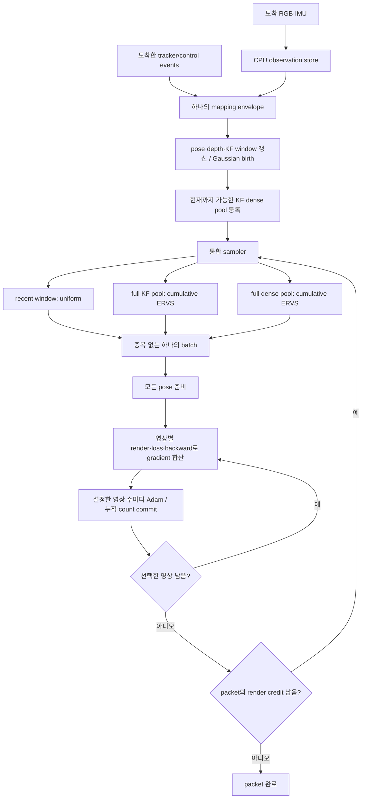

# 하나의 mapping packet과 하나의 학습 경로

구현 트리: `/home/intern/VIGS-SLAM-online-worker-integration`. `schedule="unified"`로 선택한다. 기존 paired 경로는 과거 결과 재현용으로 남기되 unified 실행에서는 사용하지 않는다.



## packet과 iteration의 구분

- **입력 packet(envelope)**은 도착 시점의 tracker/control 이벤트를 담는다. 하나의 packet에서 관측 반영과 학습을 순서대로 처리한다. 고정 예산 runner는 arrival당 envelope 하나만 worker에 제출한다.
- **선택 묶음**은 sampler가 한 번에 정하는 영상 목록이다. 기본3:3:6이면 최대12장을 선택한다. `optimizer_batch_size=1`이면 이12장을 순서대로 각각 업데이트하고,12이면 gradient를 합쳐 Adam1회 수행한다. packet 하나에서 여러 선택 묶음을 처리할 수 있다.
- 새 KF가 현재 map generation에 등록되면40 training camera render의 credit을 받는다. 새 generation에 재등록된 KF의 credit 규칙은 기존 비교와 같다. 40회라면 보통12+12+12+4로 처리한다.
- tracker packet 처리 내부의 기존 `map()` optimizer 경로는 unified 모드에서 실행하지 않는다. pose correction, depth 갱신, birth는 그대로 수행한다.
- native 학습 요청과 별도 `_render_target` 요청을 보내는 이전 방식 대신, 하나의 runtime dispatch가 credit을 소비한다. unified에서는 idle 추가 학습이 없다.

## 영상 선택

`batch_quotas=(window, keyframe, dense)`만으로 구성을 바꾼다.

1. recent KF window에서 uniform without replacement로 선택한다.
2. 전체 KF pool에서 cumulative ERVS로 선택한다. 1에서 선택한 UID만 이번 batch에서 제외한다. window에 속한 나머지 KF도 global pool의 후보이다.
3. 전체 dense pool에서 cumulative ERVS로 선택한다.
4. 빈 pool 또는 후보 부족으로 남은 자리는 사용 가능한 pool로 재배분한다. 전체 영상 수가 batch보다 작으면 작은 batch로 진행하며 동일 영상으로 억지로 채우지 않는다.

full pool은 **현재 map generation에서 지금까지 도착·등록된 전체 후보**다. 미래 pose/KF를 사용하지 않고 GPU cache eviction으로 후보를 삭제하지 않는다. 실제 배분은 bootstrap, pool 부족, 남은 credit 때문에 지정 비율과 조금 다를 수 있어 실행 ledger에 따로 기록한다.

## optimizer와 count

- KF 영상은 기존 RGBD+normal loss, dense는 RGB loss를 쓴다.
- 모든 dense pose 준비를 먼저 마친다. pose 전용 최적화와 Gaussian gradient 누적이 섞이지 않게 하기 위해서다.
- 영상별 render/backward를 순차 수행하고 설정한 optimizer 단위마다 Adam을 수행한다. 현재 기본값은 영상별1회다. 다중 영상을 동시에 rasterize하는 GPU batched renderer는 아니다. 각 render graph는 backward 뒤 해제한다.
- LR은 선택 묶음 시작 시점의 완료 render 수로 정하고 그 묶음 안에서 유지한다. optimizer 단위를 바꾸는 대조군에서도 각 영상의 LR이 같다.
- Adam 성공 후 선택한 각 영상의 누적 count를1씩 늘린다. window로 선택된 KF도 같은 count에 포함된다. 예약/취소/pose 준비는 count를 올리지 않는다.
- dense가 KF로 승격되면 count는 유지한다. 전체 map reset으로 generation이 바뀌면 새 map의 count는0부터 시작하고 이전 ledger는 보존한다.
- 선택 묶음 중 일부 업데이트가 끝난 뒤 EOS/실패가 발생하면 성공한 부분의 count와 render credit은 보존하고 남은 예약만 취소한다. 묶음 배분 순환은 Adam 횟수와 분리되어 있어 optimizer 단위를 바꿔도 같은 영상 순서를 재현할 수 있다.

## topology와 실제 online 적용 범위

unified 모드는 densify/prune, observation topology gate, 단계별 model scheduler를 끈다. 관측에서 Gaussian을 생성하는 경로와 tracker 초기화/reset은 유지한다.

기존 native `map()`의 Gaussian scale≤0.1 후처리는 별도 helper로 보존한다. tracker가 native mapping을 요청하는 경계에서 scale 상한을 적용하고 optimizer 실행은 통합 경로에 맡긴다. 처음 수행한12장 ratio 및 영상별 Adam 진단에서는 이 후처리가 빠져 있었으며, 최종 `p` arm은 이를 복원해 세 장면 검증을 통과했다(2026-09-26). 이후 선택 영상 학습으로 다음 관측 전까지 scale이 조금 변할 수 있는 동작도 기존 경로와 같다.

40 renders/KF는 연산량 제한이다. runtime은 FIFO packet 처리를 사용하므로 실제 tracking 속도보다 mapper가 느리면 queue가 쌓일 수 있다. 이번 검증은 frozen causal tracker 기록을 이용한 동일 연산량 비교이며 live deadline을 만족했다는 뜻은 아니다.

## 설정 예시

```python
online_mapping = {
    "schedule": "unified",
    "membership": "immediate",
    "selector": "ervs",
    "selection_count_scope": "all_rgb",
    "batch_quotas": (3, 3, 6),
    "optimizer_batch_size": 1,
    "renders_per_kf": 40,
    "scale_projection": True,
}
```

실제 VIGS의 기존 `online_mapping` 인자와 공통 `OnlineMapperRuntime`에서 처리한다. ratio마다 mapper를 복제하지 않는다. 정식 생산 트리는 이번 작업에서 변경하지 않았다.

동일 설정 파일: `/home/intern/VIGS-SLAM-online-worker-integration/configs/online_mapping_unified.json`. 읽은 JSON을 `online_mapping` 인자로 전달할 수 있다. 평가 실행에서는 해당 실행의 held-out UID 집합도 전달하며, 검증 runner가 이를 자동 주입한다. 최종 기본값은 `unified_view_training.py`에 정의된3:3:6과 영상별 Adam1회다.

주요 파일:

- `/home/intern/VIGS-SLAM-online-worker-integration/vigs/unified_view_training.py`: sampler, batch reserve/commit, per-KF render credit.
- `/home/intern/VIGS-SLAM-online-worker-integration/vigs/online_photometric.py`: pose 준비, KF/dense loss, gradient 합산, 단일 Adam.
- `/home/intern/VIGS-SLAM-online-worker-integration/vigs/online_mapper_runtime.py`: 통합 packet dispatch 및 credit 소비.
- `benchmarks/online_gs/campaigns/gain_attribution/run_unified_batch_panel.py`: 공통 조건 비교와 독립 실행 검증.

실험 계약은 [README](README.md), 결과와 설정 비교는 [SUMMARY](SUMMARY.md)에 기록한다.
