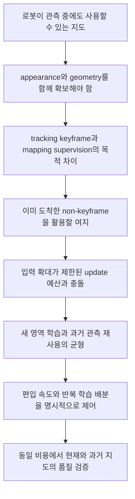

# 관측한 장면과 학습된 지도 사이의 간극

## 1. 추천하는 중심 주장

**Online Gaussian mapping의 문제는 새 프레임을 처리하는 것만이 아니라, 이미 들어온 시각적 증거를 제한된 시간 안에 지도에 반영하면서 이전에 확보한 품질도 유지하는 것이다.**

이 문장은 조사한 흐름을 종합한 문제 정의다. 그 자체가 새 발견이라는 뜻은 아니다. 관측 선택, 역사적 replay, 계산 배분은 각각 오래된 연구 주제이며, 최근에는 이를 결합한 Gaussian mapper도 등장했다. 우리 논문의 기여는 아래 결정들을 어떤 구체적 정책으로 연결했고, 무엇을 통제한 비교에서 좋아졌는지에 있어야 한다.

- Tracking에 필요하지 않은 프레임 중 어떤 것을 mapping supervision으로 사용할 것인가?
- 학습 풀을 어느 속도로 늘려야 새 관측이 들어와도 실제 학습 기회가 확보되는가?
- 과거 전체를 다시 참고할 수 있게 하면서 새 영역에 필요한 학습도 어떻게 제공할 것인가?
- 이렇게 얻은 appearance 이득이 geometry를 훼손하지 않는가?

“빠른 3DGS optimizer”보다 **시간에 따라 관측과 표현이 함께 바뀌는 mapper의 supervision 관리**로 소개하는 편이 이번 연구에 더 잘 맞는다. 단, 이를 최초로 제기한 문제라고 쓰면 안 된다.

## 2. 연구 흐름에서 실제로 반복된 불편

### 2.1 역사적 관측의 재사용은 처음부터 핵심이었다

iMAP은 neural mapping을 stability–plasticity 문제와 연결하고, 과거 keyframe을 memory로 남겨 현재 관측과 함께 재학습했다. Co-SLAM은 작은 active keyframe 집합에 제한하지 않고, 저장한 keyframe들의 ray를 전역에서 sampling하도록 범위를 넓혔다. 중요한 흐름은 “과거를 버리느냐 모두 매번 학습하느냐”라는 양자택일이 아니라, **넓은 역사적 지원 집합에서 매번 적은 양을 골라 학습하는 것**이다. [iMAP](https://arxiv.org/abs/2103.12352), [Co-SLAM](https://arxiv.org/abs/2304.14377)

이 흐름은 global pool의 정당성을 지지하지만, raw RGB 전 프레임을 영구 보존하는 것이 필수라는 증거는 아니다. Co-SLAM은 keyframe당 일부 ray만 보관한다. 정보의 유지와 원본 이미지의 무제한 저장은 구분해야 한다.

### 2.2 Gaussian 표현으로 바뀌어도 local/global 균형은 남았다

MonoGS는 local window에 더해 매 iteration 과거 keyframe 두 개를 사용한다. SplaTAM은 현재 프레임, 최근 keyframe, overlap이 높은 과거 keyframe들을 선택한다. RP-SLAM은 co-visible과 그 밖의 keyframe을 따로 sampling한다. 즉, 선행연구를 모두 “최근 window만 사용해서 과거를 잊는 방법”으로 묶는 것은 부정확하다. [MonoGS](https://arxiv.org/abs/2312.06741), [SplaTAM](https://arxiv.org/abs/2312.02126), [RP-SLAM](https://arxiv.org/abs/2412.09868)

실제 쟁점은 **각 정책이 어떤 관측에 얼마나 반복적으로 gradient를 배정하느냐**다. GS3LAM 역시 semantic Gaussian map에서 local covisibility sampling의 편향을 문제 삼는다. 다만 semantic feature의 forgetting 결과를 우리 RGB geometry에 그대로 옮겨 말하지 않는다. [GS3LAM](https://arxiv.org/abs/2603.27781)

### 2.3 과거를 유지하는 해결책이 새 관측의 학습 부족을 만들 수 있다

CaRtGS는 성장하는 keyframe pool에서 무작위 재학습을 하면 먼저 들어온 keyframe은 여러 시점에 걸쳐 선택되고, 나중에 들어온 keyframe은 학습 기회가 적어지는 현상을 직접 분석한다. loss 기반 추가 할당도 이미 제안한다. 따라서 “재학습이 필요하다”와 “재학습이 새 영역을 굶길 수 있다”는 두 문제를 함께 제시해야 한다. [CaRtGS](https://arxiv.org/abs/2410.00486)

아래 식은 그 현상을 설명하기 위한 **우리의 단순화된 모델**이다. 논문의 정리나 비볼록 최적화 수렴 증명이 아니다. 시점 s의 pool 크기가 N_s이고 b_s번 uniform draw를 한다면, i번째 뷰가 도착한 a_i부터 종료 T까지의 기대 선택 횟수는

\[
\mathbb E[n_i(T)] = \sum_{s=a_i}^{T}\frac{b_s}{N_s}.
\]

매 시점의 sampling은 균등해도 생애 전체 기회는 균등하지 않다. N_s=s, b_s=b인 장난감 모델에서는 b(H_T−H_{a_i−1})다. 실제 mapper에는 window sampling, 다른 loss, 여러 view의 공통 영역, cancel, pose revision 등이 있으므로 이 식으로 PSNR을 예측하거나 모든 뷰의 횟수를 같게 만드는 것이 최적이라고 주장할 수 없다.

### 2.4 Tracking coverage와 mapping coverage의 불일치는 문헌에 명시되어 있다

가장 유용한 증거는 HI-SLAM2의 **post-keyframe insertion**이다. PDF p.7, Fig.5에서 평균 optical flow로 선택한 keyframe들만으로 일부 frustum 경계 영역의 관측이 부족해질 수 있음을 설명하고, online 이후 추가 keyframe을 넣어 보완한다. 이것은 “카메라가 그 지역을 보았다”와 “학습에 사용된 뷰들이 충분히 그 지역을 구속한다”가 다르다는 구체적인 사례다. [HI-SLAM2](https://arxiv.org/abs/2411.17982)

여기서 연결할 질문은 **사후에 coverage를 보수하는 대신, 이미 도착한 중간 프레임을 스트리밍 중에 사용할 수 있는가?**다. 프레임 도착 전 미래 trajectory를 사용하자는 뜻이 아니다. 두 endpoint가 도착한 뒤 과거 interval의 RGB를 사용하는 지연도 명시해야 한다.

### 2.5 Non-keyframe 추가와 compute-aware scheduling에도 직접 선행연구가 있다

Lee 등의 Online 3DGS Modeling with Novel View Selection은 이미 keyframe 외 관측을 골라 추가 학습한다. 따라서 “tracking KF와 mapping view를 분리했다”는 넓은 아이디어만으로 신규성을 주장할 수 없다. 우리에게 필요한 비교는 그 선택 정책과 역사 유지 범위, 그리고 동일한 streaming budget에서의 동작이다. [Online NVS](https://arxiv.org/abs/2508.14014)

EliGSiR는 최근 공개된 RGB-D mapper로, 초기 admission과 나중 replay priority를 분리하고 retained view를 다시 활용한다. 이 연구 때문에 “관측의 가치는 시간에 따라 달라진다”거나 “bounded compute에서 admission과 replay를 관리한다”는 문장도 **공유된 문제 설정**으로 써야 한다. 차별화 후보는 RGB+IMU 입력, 완료된 작업량 기반 admission, 전역 역할별 sampling, 정확한 zero-tail 평가의 결합이지만, 이것만으로 우월성이나 최초성을 확정할 수 없다. [EliGSiR](https://arxiv.org/abs/2609.20348)

## 3. 왜 dense frame인가?

이 조사에서 dense frame은 **높은 시간 밀도의 관측 후보, 특히 tracking non-keyframe**을 뜻한다. dense depth·dense pixels·많은 Gaussians와 혼동하지 않는다.

Tracking은 pose estimation을 안정시키는 관측을 선택한다. Mapping은 Gaussian의 appearance와 geometry를 구속할 뷰가 필요하다. 두 목적은 겹치지만 동일하지 않다. Tracking에 중복인 뷰라도 가림 경계, image boundary, 작은 물체의 가시성, 샘플링 위치 차이 때문에 mapping에 유용할 수 있다. 이 중 **coverage mismatch는 HI-SLAM2와 Online NVS의 직접 근거**이고, 세부 현상별 우리 데이터에서의 이득은 추가 분석할 가설이다.

직관적인 사례는 책상 모서리를 지나가는 카메라다. 앞뒤 keyframe의 공통 영역은 tracking에 충분해도, 그 사이 프레임에만 선명하게 나타난 옆면은 training set에 빠질 수 있다. 더 많은 iteration을 같은 KF에 주어도 빠진 이미지의 관측 자체가 생기지는 않는다. 이는 설명용 예시이며 우리 실험에서 그 원인이 확인됐다는 뜻은 아니다.

그러나 **모든 중간 프레임이 유용하지는 않다.** 작은 baseline의 반복 뷰는 독립적 geometry constraint가 약하고, motion blur·잘못된 pose·exposure 변화는 오히려 해롭다. RGB만 추가해도 단안 모호성이 자동으로 해결되지 않는다. 온라인 pose 준비 비용까지 포함하면 extra view보다 KF를 더 학습하는 편이 나을 수도 있다.

권장 표현:

> Tracking을 위해 줄인 뷰 집합을 mapping supervision의 상한으로 고정하지 않고, 계산이 허용하는 추가 관측을 활용한다.

피할 표현: “Dense frames are necessary”, “Every frame adds useful information”, “Sparse keyframes cannot reconstruct accurately”.

## 4. 왜 과거 전체를 pool로 남기는가?

핵심은 **과거에 편입한 관측이 local window를 벗어났다는 이유만으로 학습 자격을 잃지 않게 하는 것**이다. 현재 관측에 맞춰 공유 Gaussian이 변하거나 geometry/pose가 수정되면, 예전에 잘 맞던 시점의 렌더링이 달라질 수 있다. 오래된 뷰는 그때 다시 확인할 수 있는 관측 제약이다. 다만 모든 과거 영역이 항상 함께 변하는 것은 아니며, 명시적 local support를 가진 Gaussian map에서 MLP와 같은 전역 forgetting을 가정하면 안 된다.

구분해야 할 집합은 다음과 같다.

\[
\mathcal C_t=\text{도착한 non-held-out 후보},\quad
\mathcal A_t\subseteq\mathcal C_t=\text{편입된 관측},\quad
\mathcal B_t\subseteq\mathcal A_t=\text{이번 update에서 선택한 관측}.
\]

실제로는 recent KF window, full KF pool, admitted dense pool을 따로 관리한다. **전체 이력 범위**, **모든 후보의 편입**, **모든 이미지의 GPU 상주**, **매번 전체 학습**은 서로 다르다. 최신 κ=16 정책은 모든 dense 후보를 편입하지 않으므로 “모든 frame을 학습한다”는 문구는 구현과도 맞지 않는다.

Global support의 장점은 과거 관측을 다시 사용할 선택권이고, 비용은 늘어나는 저장량·sampling/pose 갱신·image loading이다. Uniform sampling이면 T 시점 오래된 뷰의 당장 선택 확률도 1/N_T로 작아진다. 따라서 pool 유지 자체가 보존 성능을 보장하지 않는다. bounded reservoir, coverage coreset, uncertainty selection, submap 격리도 합리적인 대안이다. RTG-SLAM의 선택적 Gaussian update와 GLC-SLAM의 submap은 “전 프레임 replay만이 답”이라는 주장에 대한 반례 경로다. [RTG-SLAM](https://arxiv.org/abs/2404.19706), [GLC-SLAM](https://arxiv.org/abs/2409.10982)

추가로 **프레임 균등성과 장면 균등성도 다르다.** 카메라가 한 장소에 오래 머물면 비슷한 관측이 많이 쌓인다. 모든 frame을 똑같이 학습하는 empirical objective는 그 장소에 더 큰 가중치를 준다. 따라서 lifetime count를 완벽히 맞춰도 surface coverage나 정보량이 균등해지지는 않는다. 이것은 표본 구성에 따른 수학적 해석이며, 현재 실험에서 dwell-time bias가 주원인으로 확인됐다는 뜻은 아니다. “전체 pool”을 옹호하려면 retained history의 범위뿐 아니라 중복을 어떻게 다루는지 답해야 한다.

**현 단계에서 방어할 수 있는 답:** 전체 raw frame 누적이 필수라고 입증한 것이 아니라, 전체 시간 범위의 eligible history를 유지한 상태에서 계산 배분을 연구한다. 저장 정책의 필수성은 bounded-memory 대조군이 있어야 주장할 수 있다.

## 5. 두 독자 집단이 관심을 가질 연결

| 독자 | 익숙한 불편 | 우리 질문과 연결 | 가장 궁금해할 증거 |
|---|---|---|---|
| Robotics/SLAM | tracker가 실시간이어도 지금 필요한 지도가 미완성일 수 있음 | frame 처리율과 map readiness를 분리 | 관측 후 품질 도달 지연, 시점별 held-out, zero-tail, tracking 간섭 |
| Robotics/SLAM | loop/pose correction, 오래된 영역의 유지, 메모리 증가 | 현재 영역의 학습과 과거 제약의 유지 | 오래된 영역의 품질 곡선, corrected pose 사용, RAM/VRAM 증가 |
| Gaussian rendering | train view에는 맞지만 held-out·경계·geometry가 나쁨 | tracking KF 이외 관측의 추가 가치 | 같은 loss·pose·render 수의 dense/KF 비교, geometry GT |
| Gaussian optimization | 계산을 더 쓰거나 loss/Adam을 바꾼 효과와 섞임 | admission과 sampling의 독립 기여 | wall-clock/Pareto, uniform/RR/loss-priority 비교 |

로봇과 연결하는 가장 안전한 도입은 **지도가 관측을 합성하고 공간을 질의하는 중간 표현으로 사용된다**는 것이다. Splat-Nav는 navigation의 사례, SplatSim은 visual policy 학습용 렌더링의 사례다. 두 논문을 우리의 online map 품질이 로봇 성공률을 높였다는 근거로 쓰면 안 된다. [Splat-Nav](https://arxiv.org/abs/2403.02751), [SplatSim](https://arxiv.org/abs/2409.10161)

실제 online autonomy 사례인 Ong 등의 연구는 noisy geometry와 pose가 navigation 및 렌더링에 부담을 준다고 논의한다. 그래서 geometry는 뜬금없는 별도 문단이 아니라, 지도 usefulness의 조건으로 첫 부분부터 함께 제시할 수 있다. [GS for Autonomy](https://arxiv.org/abs/2505.11794)

VLA는 선택적인 한 문장이면 충분하다. GS-VLA는 Gaussian 기반 view normalization을 VLA 입력에 적용하지만, 우리의 누적 scene map이나 replay의 필요성을 입증하는 연구는 아니다. “VLA가 뜨니까 모든 로봇에 dense map이 필수”로 논리를 점프하지 않는다. [GS-VLA](https://arxiv.org/abs/2608.19066)

## 6. 권장 narrative

독자가 기억할 문장 후보는 **“A frame can be redundant for tracking yet remain useful for mapping.”**와 **“Retaining an observation does not guarantee that the map has learned from it.”**다. 두 문장은 이 조사의 독자적 요약 문구이며 특정 논문의 인용문이 아니다. 첫 문장은 보편 정리가 아니라 실험으로 확인할 가설과 연결하고, 두 번째는 pool 크기만 보고 성공을 판단하지 말자는 뜻으로 쓴다.

이 방향이면 dense frames와 historical pool이 억지로 묶인 두 트릭이 아니라 **관측을 학습 가능한 제약으로 전환하는 과정의 두 결정**으로 연결된다. 그래도 어느 결정의 이득이 입증됐는지는 다음 문서처럼 따로 보고해야 한다.
